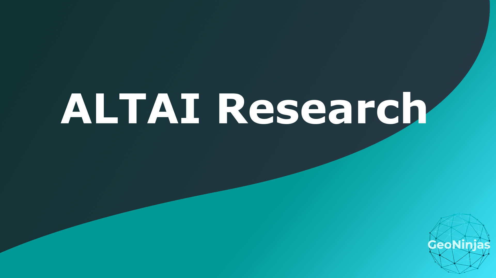

# ALTAI Framework

## GeoNinjas
### Panna Pfandler(225928), Wojciech Stachowiak(222679), Bogdan Matache(225108), Thijn van Oort(212396)
#### 23/06/2023 Breda University of Applied Science
 

## Human Agency and Oversight
### Human Agency and Autonomy

The AI system predicts house value and can provide useful insight, but it should not be solely relied upon for decision making that may impact humans or society. Our recommendation is for a human to make the final decision thus having data enhanced decision making.

- Human Oversight

### Technical Robustness and Safety
- Resilience to Attack and Security
- General Safety
- Accuracy
- Reliability
- Fall-back plans and Reproducibility

### Privacy and Data Governance
- Privacy
- Data 
- Governance 
- Transparency
- Traceability
- Explainability
- Communication

### Diversity, Non-discrimination and Fairness
- Avoidance of Unfair Bias
- Accessibility and Universal Design
- Stakeholder Participation 

### Societal and Environmental Well-being
- Environmental Well-being
- Impact on Work and Skills
- Impact on Society at large or Democracy 

### Accountability
- Auditability
- Risk Management 

